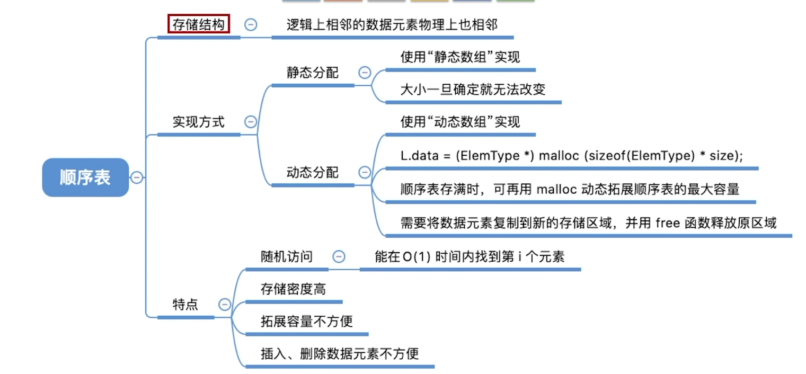

# 线性表

数据结构的三要素：逻辑结构、数据的运算、物理结构（存储结构）

#### 线性表的定义：

线性表是具有相同数据类型的n(n>=0)个数据元素的有限序列。

除第一个元素外，每一个元素都有且仅有一个直接前驱、除最后一个元素外，每一个元素都有且仅有一个直接后驱。

#### 常见操作：

1. InitList(&L) 初始化表的默认值
2. DestoryList(&L) 销毁线性表
3. ListInsert(&L,i,e)

#### 线性表的物理结构:

1. 顺序表（顺序存储）：

   用顺序存储的方式实现线性表顺序存储，即把逻辑上相邻的元素存储在物理位置上也相邻的存储单元中，数据结构的罗杰结构能够根据物理结构直观体现。

   

   ```c
   //初始化顺序表
   void InitList(SeqList& L) {
   	L.data = (ElemType*)malloc(InitSize * sizeof(ElemType));
   	L.MaxSize = InitSize;
   	L.length = 0;
   };
   //增加动态数组长度
   void IncreaseSize(SeqList& L, int len) {
   	ElemType* p = L.data;
   	L.data = (ElemType*)malloc((L.MaxSize + len) * sizeof(ElemType));
   	L.MaxSize += len;
   	for (int i = 0; i < L.length; i++) {
   		L.data[i] = p[i];
   	}
   	free(p);
   };
   ```

2. 链表（链式存储）：

